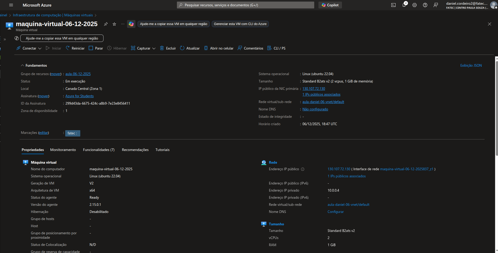

## Aplicando conteúdo em laboratório prático (Azure)

Nesta aula, o professor Odair realizou a síntese de todos os conteúdos mencionados até então. Foi criada uma **VNet (Rede Virtual)** e, posteriormente, uma **VM (Máquina Virtual)** utilizando o Azure.

---

### Aplicando conceitos teóricos de forma prática na nuvem Azure

---

### Criação de uma Máquina Virtual Linux Ubuntu 22.04 LTS

---

### Realização da conexão via SSH

