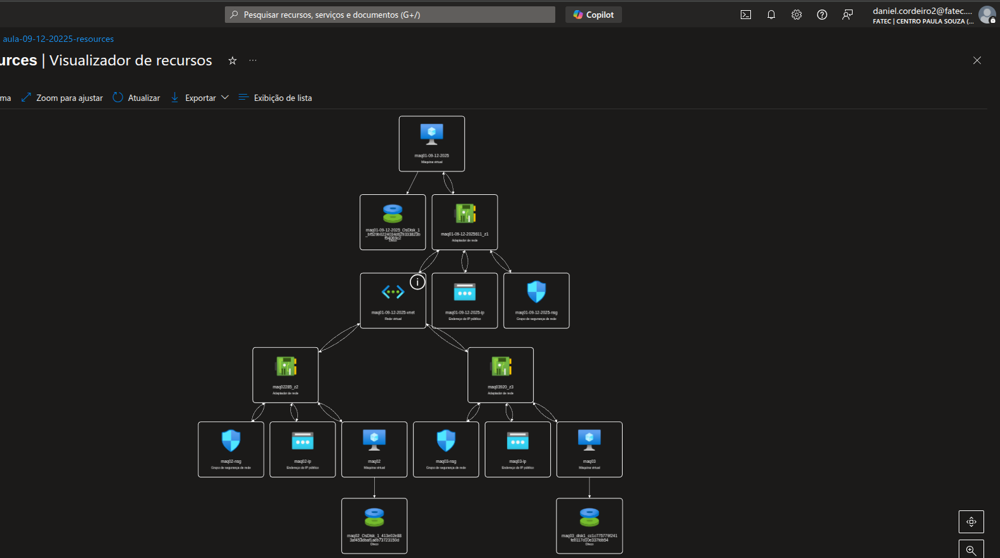
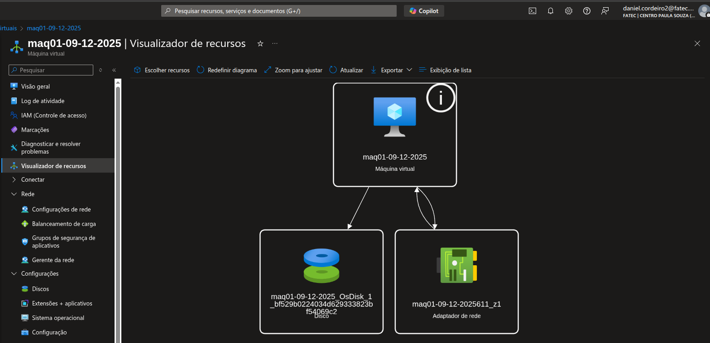
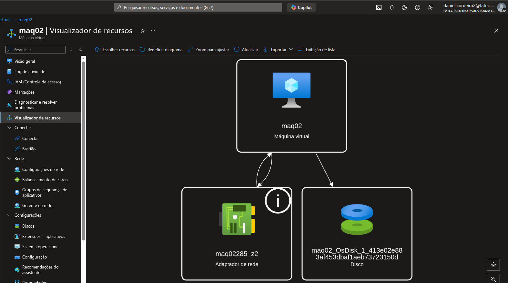
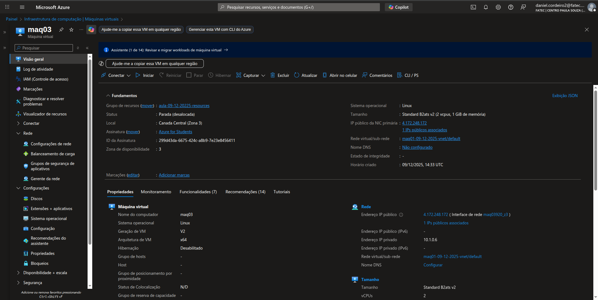
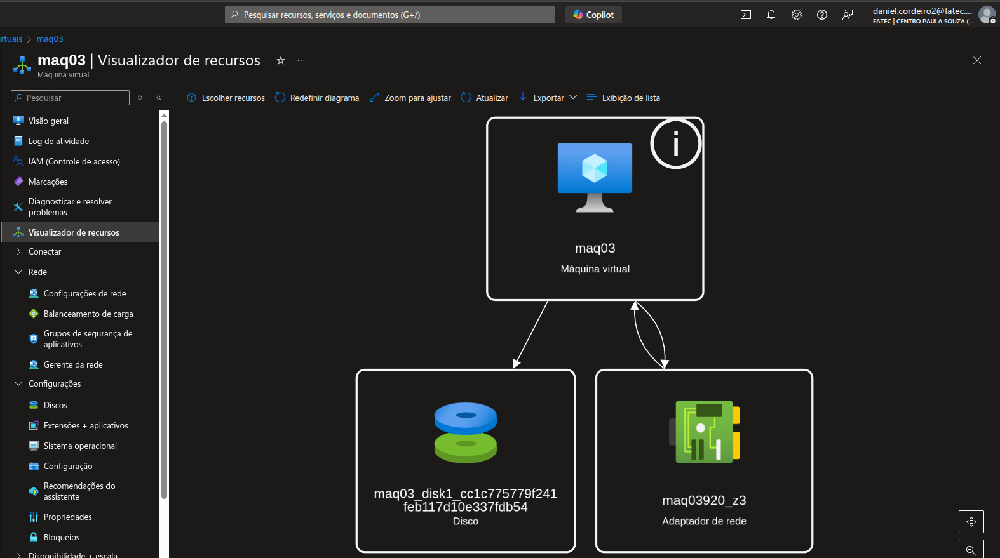

# Aula 09/12/2025

## Objetivo da Tarefa
Criar 3 Máquinas Virtuais (VMs) no Azure, definindo regiões e zonas de disponibilidade, ambas conectadas na mesma rede.

---

## Visualização dos Recursos



---

## Máquina Virtual 1

### Configuração
- **Imagem:** Ubuntu 22.04 LTS
- **Zona:** 01 / Canada
- **Rede Virtual:** maq-01-09-12-2025-vnet

### Capturas de Tela



### Credenciais de Acesso
```bash
# Usuário
maq01
```
```bash
# Senha
password123@@
```
```bash
# Conexão SSH
ssh maq01@20.151.84.151
```

---

## Máquina Virtual 2

### Configuração
- **Imagem:** Ubuntu 22.04 LTS
- **Zona:** 02 / Canada
- **Rede Virtual:** maq-01-09-12-2025-vnet

### Capturas de Tela



### Credenciais de Acesso
```bash
# Usuário
maq02
```
```bash
# Senha
password123@@
```
```bash
# Conexão SSH
ssh maq02@4.172.224.8
```

---

##  Máquina Virtual 3

### Configuração
- **Imagem:** Ubuntu 22.04 LTS
- **Zona:** 03 / Canada
- **Rede Virtual:** maq-01-09-12-2025-vnet

### Capturas de Tela



### Credenciais de Acesso
```bash
# Usuário
maq03
```
```bash
# Senha
password123@@
```
```bash
# Conexão SSH
ssh maq03@4.172.248.172
```

---

